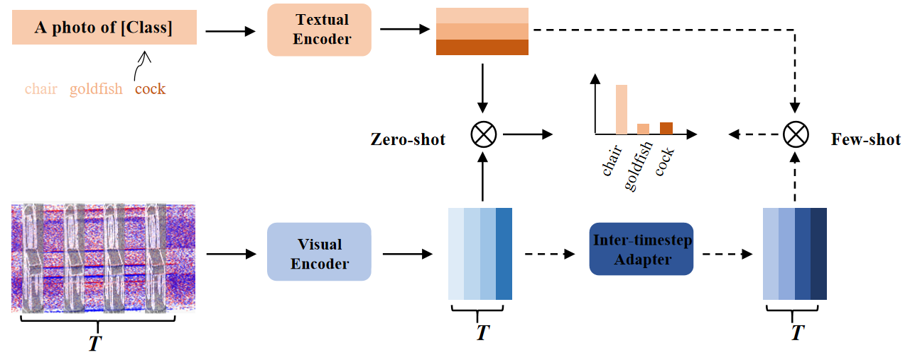

# NeuroCLIP: Neuromorphic Data Understanding by CLIP and SNN

Official implementation of NeuroCLIP.

## Introduction

NeuroCLIP  uses the CLIP’s 2D pre-trained knowledge to understand the neuromorphic data.

<div align="center">
  
</div>

## Requirements

### Installation

Create a conda environment and install dependencies:

```bash
git clone https://github.com/yfguo91/NeuroCLIP.git
cd NeuroCLIP

conda create -n neuroclip python=3.7
conda activate neuroclip

pip install -r requirements.txt

# Install the according versions of torch and torchvision
conda install pytorch torchvision cudatoolkit

# Install the modified dassl library (no need to re-build if the source code is changed)
cd Dassl3D/
python setup.py develop

cd ..
```

### Dataset

The dataset will be download automatically.

## Get Started

### Zero-shot NeuroCLIP

Edit the running settings in `scripts/zeros.sh`, e.g. config file and output directory. Then run Zero-shot NeuroCLIP:

```bash
cd scripts
bash zeros.sh
```

If you need the post-search for the best view weights, add `--post-search` and modulate the search parameters in the config file. More search time leads to higher search results but longer time.

### Few-shot NeuroCLIP

Set the shot number and other settings in `scripts/fews.sh`. Then run NeuroCLIP with the inter-tiemstep adapter:

```bash
cd scripts
bash fews.sh
```

`--post-search` is also optional.

## Acknowlegment

This repo benefits from [CLIP](https://github.com/openai/CLIP), [SimpleView](https://github.com/princeton-vl/SimpleView) and the excellent codebase [Dassl](https://github.com/KaiyangZhou/Dassl.pytorch),[PointCLIP](https://github.com/ZrrSkywalker/PointCLIP). Thanks for their wonderful works.

## Citation

```bash
@article{guo2023neuroclip,
  title={NeuroCLIP: Neuromorphic Data Understanding by CLIP and SNN},
  author={},
  journal={arXiv preprint arXiv:2112.02413},
  year={2023}
}
```

## Contact

If you have any question about this project, please feel free to contact yfguo@pku.edu.cn.
